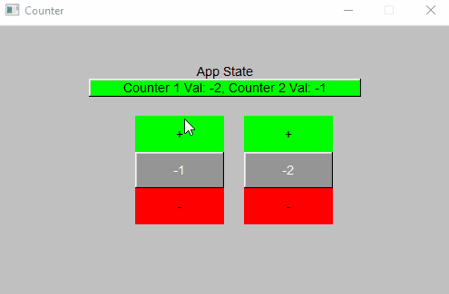
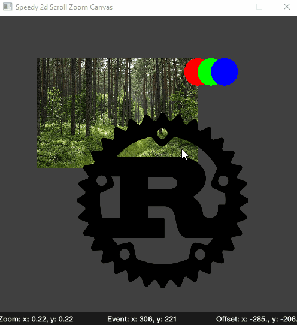
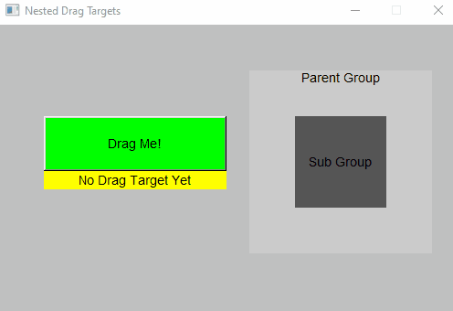

# FLTK-RS Examples


A small collection of modular UI features made with the [fltk-rs](https://github.com/MoAlyousef/fltk-rs) library.

# Table of Contents

- [FLTK-RS Examples](#fltk-rs-examples)
- [Table of Contents](#table-of-contents)
  - [State](#state)
    - [State](#state-1)
    - [comp_state](#comp_state)
  - [Custom Widget Examples](#custom-widget-examples)
    - [Fuzzy Search Table](#fuzzy-search-table)
    - [Image Selection](#image-selection)
    - [Speedy2d Pan/Zoom Canvas](#speedy2d-panzoom-canvas)
  - [Misc Demos](#misc-demos)
    - [Nested Drag targets](#nested-drag-targets)
    - [Background Fill for Group](#background-fill-for-group)
  - [Event Handling](#event-handling)
    - [Crossbeam Channels](#crossbeam-channels)
    - [Ordinal Custom Events](#ordinal-custom-events)
    - [Misc](#misc)

---

## State



Handling state in rust can be tricky. These examples with a simple counter demonstrate different approaches to managing and mutating state in your app.

### State

Use the [state crate](https://github.com/sergiobenitez/state) to mutate and reference a global hashmap of widget values.

### comp_state

Use [comp_state](https://github.com/rebo/comp_state) to mutate and reference local counter values in a react-like fashion. Requires running with `cargo +nightly run`

## Custom Widget Examples

### Fuzzy Search Table

Fuzzy search a table of random strings, powered by [Sublime Fuzzy](https://crates.io/crates/sublime_fuzzy).


### Image Selection

Select a portion of an image from one frame and draw it in another frame.


### Speedy2d Pan/Zoom Canvas

A hardware accelerated pan/zoom canvas using [Speedy2d](https://github.com/QuantumBadger/Speedy2D) as the render engine.



## Misc Demos

### Nested Drag targets

Simple demonstration of using `app::belowmouse()` to differentiate between nested widgets with Dnd Events



### Background Fill for Group

Demonstrates creating a group that has a solid background color over which child widgets are drawn.


## Event Handling

### Crossbeam Channels

Simple app demonstrating demonstrating handling channeled events (which have the advantage of carrying data) as well as custom events, all the while keeping fn main() clean.


### Ordinal Custom Events

using `app::handle_main` can result in more ergonomic code, allowing any widget to handle the event, keeping `main` more organized. However, custom event values are hard coded. [enum_ordanlize](https://docs.rs/enum-ordinalize/3.1.10/enum_ordinalize/) lets us define our custom event values relative to the number of total enum values. Thus we can insert or remove custom events without worrying about disjoint values.

```rust
#[derive(Debug, PartialEq, Eq, Ordinalize)]
#[repr(i32)]
enum CustomEvents{
    AddOne = 41,
    AddTwo,
    AddThree,
}
//..
win.handle(move |_, ev|
    if ev.bits() == CustomEvents::AddOne.ordinal(){
    *counter.borrow_mut() += 1;
    true
} else if ev.bits() == CustomEvents::AddTwo.ordinal(){
    *counter.borrow_mut() += 2;
    true
} else if ev.bits() == CustomEvents::AddThree.ordinal(){
    *counter.borrow_mut() += 3;
    true
} else {
    false
});

```

### Misc

- For detailed windows installation seeksthe fltk-rs wiki
- Make sure your project directory path isn't too long, see [https://stackoverflow.com/questions/49603759/msb6003-the-specified-task-executable-cl-exe-could-not-be-run](https://stackoverflow.com/questions/49603759/msb6003-the-specified-task-executable-cl-exe-could-not-be-run)
- `children()` for `Scroll` counts the vertical and horizontal sliders, so subtract 3 from that number to get the actual count
