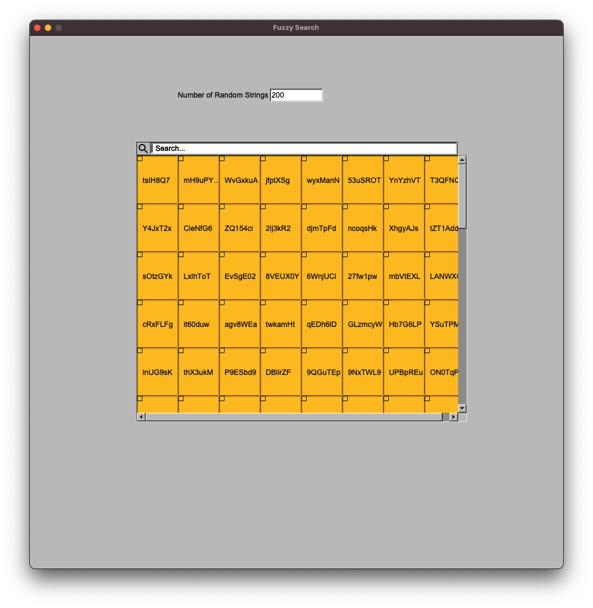
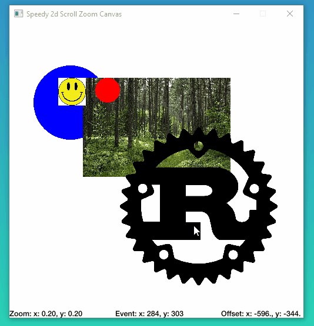

# FLTK-RS Examples

A small collection of modular UI features I'm creating while I'm developing MuTex, written with the [fltk-rs](https://github.com/MoAlyousef/fltk-rs) library.

Included Examples:

- Fuzzy Search Table
- Image Selection
- Speedy2d Zoom/Pan Canvas

---

## Fuzzy Search Table

Fuzzy search a table of random strings, powered by [Sublime Fuzzy](https://crates.io/crates/sublime_fuzzy).

## Image Clipping

Use the Image Crate to do crop and greyscale a selected portion of an image, then set it to a new frame.

## Speedy2d Pan/Zoom Canvas

A hardware accelerated pan/zoom canvas using [Speedy2d](https://github.com/QuantumBadger/Speedy2D) as the render engine.

<!--  -->

## Background Fill for Group

Demonstrates creating a group that has a solid background color over which child widgets are drawn.

Test

